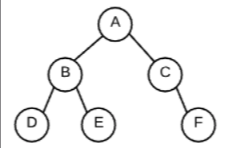
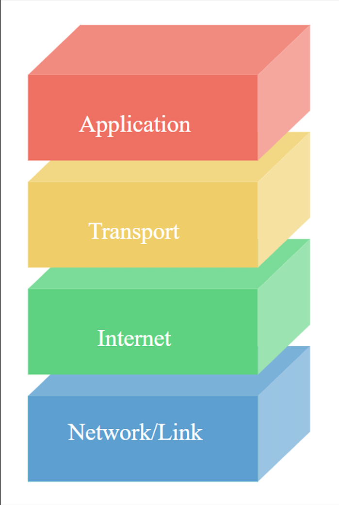

# Week 8 Multiple-choice
### 1. Which of these approaches are commonly used to store graph data?
    [ ] Adjacency Pool
    [ ] Object Orientation
    [ x ] Adjacency Matrix
    [ x ] Adjacency List

### 2. What is the only node for a binary (or any) tree that does not have a parent node?
    [ ] A sibling node
    [ ] A subtree node
    [ ] A leaf node
    [ x ] A root node

### 3. TCP connections provide two important needs for computer-to-computer communications. Choose them from the following list.
    [ x ] Reliable data transfer
    [ ] Persistent & consistent connections
    [ x ] Ethernet protocol management
    [ ] MAC addresses

### 4. How many leaf nodes are in the image of the tree?
    [ ] 5
    [ ] 1
    [ ] 4
    [ ] 2
    [ ] 3
### 5. The first four bits of an IPv6 packet's header is the version number that translates to "6". Which of the following binary representations represents the number 6?
    [ ] 1010
    [ x ] 0110
    [ ] 0101
    [ ] 1100

### 6. The first four bits of an IPv4 packet's header is the version number that translates to "4". Which of the following binary representations represents the number 4?
    [ ] 0001
    [ ] 0010
    [ ] 1000
    [ x ] 0100

### 7. In a binary search tree, which of the following depth-first tree traversal methods would result in retrieving the nodes in *ascending sorted order*?
    [ ] Min-max-order
    [ ] Post-order
    [ x ] Pre-order
    [ ] In-order

### 8. Assuming that a *binary* tree has four nodes, what is the *minimum* number of leaf nodes the tree could have?
    [ ] 3
    [ ] 4
    [ x ] 1
    [ ] 2

### 9. Choose the following conditions that MUST be met for a binary tree to be a binary tree. (*multi-select*)
    [ x ] The left subtree is a binary search tree
    [ x ] The left subtree contains values less than the root
    [ x ] The right subtree is a binary search tree
    [ x ] The right subtree contains values greater than or equal to the root

### 10. What are the two major classifications of tree traversal that you learned about in this material?
    [ ] Up-down traversal
    [ x ] Breadth-first traversal
    [ x ] Depth-first traversal
    [ ] Width-first traversal

### 11. What protocol does the above image model?
    [ ] MAC
    [ ] HTTP
    [ ] OSI
    [ x ] TCP/IP

### 12. Assuming that a binary (or any) tree is not empty, what is the least number of parent nodes that a binary tree can have?
    [ ] 1
    [ ] 3
    [ ] 2
    [ x ] 0

### 13. What type of search would you use to determine the shortest distance between two people in a social network?
    [ x ] A breadth-first search
    [ ] A cyclic search
    [ ] A relationship search
    [ ] A depth-first search

### 14. Assuming that a *binary* tree has four nodes, what is the *maximum* number of leaf nodes the tree could have?
    [ ] 3
    [ x ] 2
    [ ] 1
    [ ] 4

### 15. In the Domain Name Service (DNS), which one of the following record types indicates the server that can handle email traffic?
    [ ] An SOA record
    [ x ] An MX record
    [ ] An A record
    [ ] An NS record

### 16. How many nodes the tree in the image have?
    [ x ] 6
    [ ] 5
    [ ] 8
    [ ] 7
    [ ] 4

### 17. Of the following features, which ones can a graph have but a tree cannot?
    [ ] A graph can have leaf nodes but a tree cannot have leaf nodes
    [ x ] A graph can have cycles but a tree cannot
    [ x ] A graph can have no root node but a tree must have a root
    [ ] A graph can have only one node but a tree must have more than one node

### 18. In the Domain Name Service (DNS), which one of the following record types maps a domain name such as "appacademy.io" directly to an IP address?
    [ ] A CNAME record
    [ ] An SOA record
    [ x ] An A record
    [ ] An NS record

## Key
1. Adjacency Matrix & Adjacency List
1. A root node
1. Reliable data transfer & Ethernet protocol management (this answer is questionable - do further reading to confirm)
1. 3
1. 0110
1. 0100
1. Pre-order
1. 1
1. ALL ANSWERS
1. Breadth- & Depth-first traversal
1. TCP/IP
1. 0
1. A breadth-first search
1. 2
1. An MX record
1. 6
1. A graph can have cycles but a tree cannot & a graph can have no root node but a tree must have a root
1. An A record
